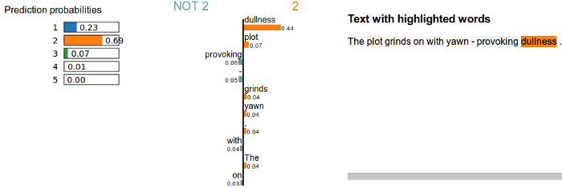
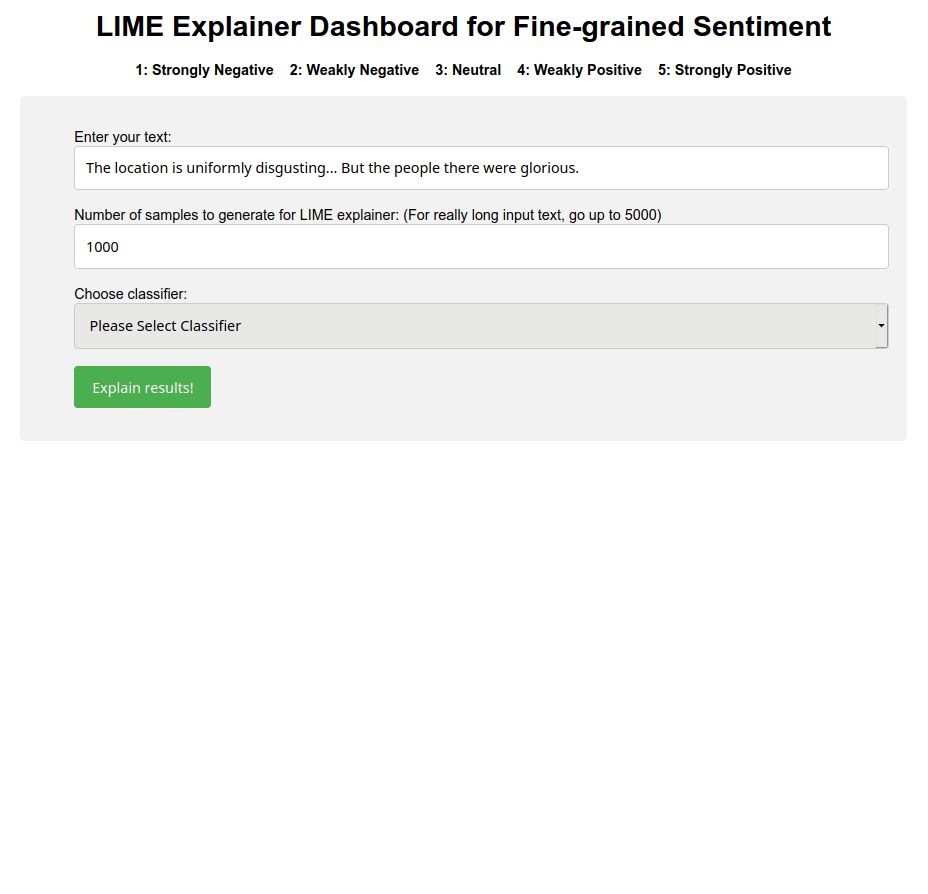
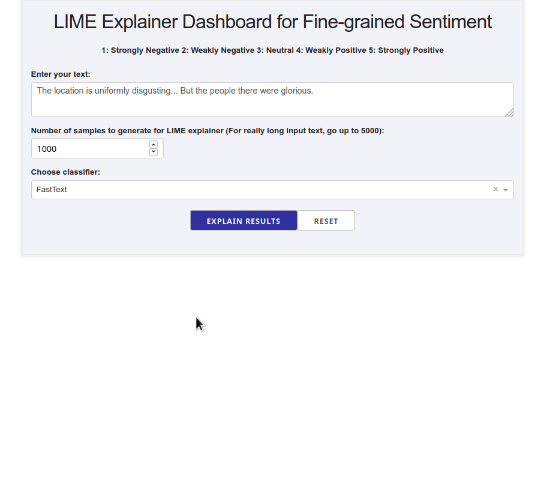
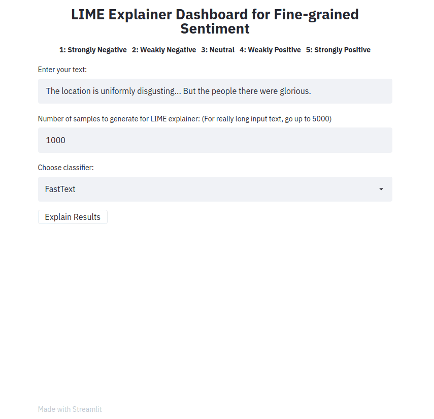

# Background

In [an earlier post](https://towardsdatascience.com/fine-grained-sentiment-analysis-in-python-part-2-2a92fdc0160d), I described how to explain a fine-grained sentiment classifier's results using LIME (**L**ocal **I**nterpretable **M**odel-agnostic **E**xplanations). To recap, the following six models were used to make fine-grained sentiment class predictions on the Stanford Sentiment Treebank (SST-5) dataset.

* Rule-based models: **TextBlob** and **VADER**
* Feature-based models: **Logistic regression** and **Support Vector Machine**
* Embedding-based models: **FastText** and **Flair**

A linear workflow was used to analyze and explain the sentiment classification results using each method. Each model was trained on 5 classes of sentiment (1 through 5), with 1 being "strongly negative", 3 being "neutral" and 5 being "strongly positive".


The goal of this post is to show how to build an explainer dashboard (using any one of three frameworks) that takes in a trained model, and outputs LIME explanations for the prediction made by the model.

## Example LIME explanation
Put simply, LIME generates an explanation object containing visualizations (as embedded JavaScript) that can be output to an HTML file, which can then be opened in any browser. A typical output from LIME is shown below.



## Why build an interactive dashboard app?
To explain a classifier's results using LIME, it can be cumbersome to have to write out individual HTML files each time an explanation needs to be made. An interactive dashboard that takes in user input is a very effective means to rapidly iterate through multiple test samples in real time, providing the user with immediate feedback. In addition, having a dashboard allows non-technical users (who may or may not know how to execute Python scripts) to be able to make their own LIME explanations on demand.

The below sections show how we can build LIME explainer dashboards using three different frameworks.

# Explainer class
To easily reference each classifier's predict methods, the below object-oriented template is applied to enable code reuse, available in[the project's GitHub repo](https://github.com/prrao87/fine-grained-sentiment/blob/master/explainer.py). In a nutshell, a Python class is defined which takes in the list of variations generated by LIME (random text samples with tokens blanked out), following which we output a class probability for each sample as a numpy array.

```python
class ExampleExplainer:
    """Class to explain classification results.
       The `predict` method outputs a numpy array of floats, which
       is the classifier's prediction probability for each class.
    """
    def __init__(self, path_to_model: str) -> None:
        # Load in a trained classifier model

    def predict(self, texts: List[str]) -> np.array([float, ...]):
        # Take in a list of strings (LIME text sample of variations)
        ...
        # Output class probabilities as a numpy array
        return np.array(predict_proba)
```

Once the class probabilities for each variation is returned, this can be fed to the `LimeTextExplainer` class (shown below). Enabling bag-of-words (`bow`) would mean that LIME doesn’t consider word order when generating variations. However, the FastText and Flair models were trained considering n-grams and contextual ordering respectively, so for a fair comparison between models, the `bow` flag option is disabled for all explanations on SST-5.

The `exp` object returned by the LIME explainer is via the `explain_instance` method internal to LIME, that converts the local linear model’s predictions (in numerical form) to a visual, interpretable form. This can then be output as HTML.

```python
def explainer(
        method: str,
        path_to_file: str,
        text: str,
        num_samples: int) -> LimeTextExplainer:
    """Run LIME explainer on provided classifier"""
    model = explainer_class(method, path_to_file)
    predictor = model.predict

    # Create a LimeTextExplainer
    explainer = LimeTextExplainer(
        # Specify split option for string
        split_expression=lambda x: x.split(),
        # Our classifer uses N-grams or contextual ordering to classify text
        # Hence, order matters, and we cannot use bag of words.
        bow=False,
        # Specify class names for this case
        class_names=[1, 2, 3, 4, 5]
    )

    # Make a prediction and explain it:
    exp = explainer.explain_instance(
        text,
        classifier_fn=predictor,
        top_labels=1,
        num_features=20,
        num_samples=num_samples,
    )
    return exp
```

The below sections describe how to encapsulate all these functions into an interactive dashboard app.

# Option 1: Flask

A Flask version of the LIME explainer dashboard is shown below. The user enters a piece of text, selects the number of random samples to generate for LIME, and then chooses from a given list of classifiers using the dropdown menu. Clicking on the `Explain results!` button then generates a LIME explanation HTML object, which is rendered in an HTML Iframe.



Although Flask isn't a data dashboarding tool (it is a [WSGI](https://wsgi.readthedocs.io/) web framework that began as a wrapper around [Werkzeug](https://werkzeug.palletsprojects.com/) and [Jinja](https://palletsprojects.com/p/jinja/)), it provides a simple plugin-based architecture from which developers can build and extend interfaces for complex applications. The key strength of Flask is its robustness in a production setting and the numerous extensions around it in the Python ecosystem.

To build a LIME explainer dashboard using Flask, it is required to know about the following pieces of technology:

* __HTML/JavaScript__: A page's overall structure and content is defined using HTML. Any actions that need to be triggered based on a field's value or user input needs to be defined using JavaScript, either through the HTML file itself, or loaded from an external source.
* __CSS__: A page's styles and layout are defined using a CSS file.
* __Jinja2__: This is a templating engine that generates the page's HTML dynamically from within Python. It is necessary because of security reasons (not using templates and passing around unescaped, static HTML can result in cross-site scripting attacks). The template engine is controlled from within Python, and the final HTML is rendered using Flask methods.

## Flask app: directory structure
The directory structure used for the Flask app is shown below. The required styles are configured using CSS in the `static/style.css` file, and the HTML template to be rendered is defined in `templates/index.html`. Any trained sentiment classifier models go into the `models` directory. The explainer class is defined in `lime_explainer.py` and the Flask routes in `app.py`.

```
.
├── models
|   ├── classifier1
|   └── classifier2
├── static
|   └── style.css
└── templates
|   └── index.html
├── app.py
└── lime_explainer.py
```

For this use case, the application code in Flask is written in the simplest way possible. Two routes are defined (the default route `'/'` and the route for the LIME results, `'result'`). Note that the results route uses a `POST` request, meaning that it only generates HTML (via Jinja) once the user inputs some information to the app and interacts with it.

```python
import os
from flask import Flask, request, render_template
from lime_explainer import explainer, tokenizer, METHODS

app = Flask(__name__)
SECRET_KEY = os.urandom(24)

@app.route('/')
@app.route('/result', methods=['POST'])
def index():
    exp = ""
    if request.method == 'POST':
        text = tokenizer(request.form['entry'])
        method = request.form['classifier']
        n_samples = request.form['n_samples']
        if any(not v for v in [text, n_samples]):
            raise ValueError("Please do not leave text fields blank.")

        if method != "base":
            exp = explainer(method,
                            path_to_file=METHODS[method]['file'],
                            text=text,
                            lowercase=METHODS[method]['lowercase'],
                            num_samples=int(n_samples))
            exp = exp.as_html()

        return render_template('index.html', exp=exp, entry=text, n_samples=n_samples, classifier=method)
    return render_template('index.html', exp=exp)


if __name__ == '__main__':
    app.secret_key = SECRET_KEY
    app.run(debug=True)
```

The code for the Flask LIME explainer app is [available here on GitHub](https://github.com/prrao87/fine-grained-sentiment-app).


# Option 2: Dash (by Plotly)
An alternate approach to designing a LIME dashboard is using Plotly's [Dash](https://plotly.com/dash/) library. Dash is a framework for building analytical web applications in Python. The benefits to using Dash are twofold: developers can design applications using just Python (no JavaScript required), and they have full control over the design and structure of the app via CSS. A LIME explainer app written using Dash is demonstrated below. Just as in the case of the Flask app, clicking on the `Explain results` button generates a LIME explanation HTML object, which is rendered via Dash's wrapper around HTML Iframes.
 


## Dash app: directory structure
The directory structure used for the Dash app is shown below. The required styles are configured using CSS in the `assets/style.css` file. Unlike in the Flask example, the HTML layout of the app and the routes/interactions are defined using pure Python, in `app.py`. Any trained sentiment classifier models go into the `models` directory. The explainer class is defined in `lime_explainer.py`.

```
.
├── models
|   ├── classifier1
|   └── classifier2
├── assets
|   └── style.css
├── app.py
└── lime_explainer.py
```

The key components of a Dash application's code are described below. The first is the application layout, which is written in Python using Dash's HTML wrappers.

```python
# ======== App layout ======== 
app.layout = html.Div([
    html.H3('''
        LIME Explainer Dashboard for Fine-grained Sentiment
    ''', style={'text-align': 'center'}),
    html.Label('''
        1: Strongly Negative 2: Weakly Negative 3: Neutral 4: Weakly Positive 5: Strongly Positive
    ''', style={'text-align': 'center'}),
    html.Br(),
    html.Label('Enter your text:'),
    html.Div(
        dcc.Textarea(
            id='text-input',
            placeholder='Enter text to make class prediction and generate explanations for',
            className='textarea',
            style={
                'width': '100%', 'height': 50, 'verticalAlign': 'top',
                'fontFamily': 'Arial', 'fontColor': '#515151',
            }
        ),
        style={'display': 'flex', 'justifyContent': 'center'}
    ),
])
```
Common HTML objects such as headers, labels, text inputs and Iframes can be easily added using Python constructs as shown.

The next component is the *callback*, which is a reactive, functional piece of code that allows developers to observe, modify and update properties of any component in the UI. In Dash, callbacks are defined using Python's decorator syntax. Callbacks are extremely powerful ways to encode interactivity in an application, as they track states *on button-clicks* as well as on data updates. The primary callback used in the LIME explainer is shown below.

```python
@app.callback(Output('text-input', 'value'),
              Input('reset-button', 'n_clicks'))
def clear_form(n_clicks):
    """Empty input textarea"""
    return ""


@app.callback(Output('explainer-obj', 'children'),
              Input('submit-button', 'n_clicks'),
              Input('reset-button', 'n_clicks'),
              State('case-dropdown', 'value'),
              State('num-samples-input', 'value'),
              State('text-input', 'value'))
def generate_explainer_html(submit_n_clicks, reset_n_clicks, case, n_samples, text):
    ctx = dash.callback_context  # Capture callback context to track button clicks
    empty_obj = html.Iframe(
        srcDoc='''<div>Enter input text to see LIME explanations.</div>''',
        width='100%',
        height='100px',
        style={'border': '2px #d3d3d3 solid'},
        hidden=True,
    )
    if not text or "reset" in ctx.triggered[0]["prop_id"]:
        # Return empty Iframe
        obj = empty_obj
    else:
        # Tokenize text using spaCy
        text = tokenizer(text)
        exp = explainer(case,
                        path_to_file=METHODS[case]['file'],
                        text=text,
                        lowercase=METHODS[case]['lowercase'],
                        num_samples=int(n_samples))
        obj = html.Iframe(
            # Javascript is disabled from running in an Iframe for security reasons
            # Static HTML only!!!
            srcDoc=exp.as_html(),
            width='100%',
            height='800px',
            style={'border': '2px #d3d3d3 solid'},
        )
    return obj
```
As per the above construct, we pass the user's button click (either the "Submit" or the "Clear" button), as well as the *states* of the dropdown menu, number of samples entered in the text input, and the text sample for which we want to predict the sentiment. Tracking the state (as opposed to just the *value*) of each text field here is important — it allows us to tie the execution of the callback to the *button click*, rather than executing it every time a value in the text input is updated.

The code for the Dash LIME explainer app is [available here on GitHub](https://github.com/prrao87/fine-grained-sentiment-app-dash).

# Option 3: Streamlit
Another alternative is to use [Streamlit](https://www.streamlit.io/) to build the explainer app. This is by far the fastest approach, requiring a very basic knowledge of web development and the fewest lines of code. Unlike the Flask and Dash approaches, the Streamlit app uses its own styles and layout (no customizations via CSS are possible, at least using conventional means). The Streamlit LIME explainer app is shown in action, below.



Because Streamlit is designed from the ground up to assist in the fast creation and sharing of web apps, the LIME dashboard app has an exceptionally simple directory structure. All the code for the web application is written in a single file, `app.py` — this includes widgets, structure, interactions and all user inputs to make LIME predictions. The remarkable aspect of this design is that even with all this functionality crammed into one file, it is still very concise (~40 lines of code!). As a result, we only use separate directories for application-specific entities, such as models and data.

```
.
├── models
|   ├── classifier1
|   └── classifier2
├── app.py
└── lime_explainer.py
```

The entire code for the Streamlit dashboard is shown below.

```python
# Build app
title_text = 'LIME Explainer Dashboard for Fine-grained Sentiment'
subheader_text = '''1: Strongly Negative &nbsp 2: Weakly Negative &nbsp  3: Neutral &nbsp  4: Weakly Positive &nbsp  5: Strongly Positive'''

st.markdown(f"<h2 style='text-align: center;'><b>{title_text}</b></h2>", unsafe_allow_html=True)
st.markdown(f"<h5 style='text-align: center;'>{subheader_text}</h5>", unsafe_allow_html=True)
st.text("")
input_text = st.text_input('Enter your text:', "")
n_samples = st.text_input('Number of samples to generate for LIME explainer: (For really long input text, go up to 5000)', value=1000)
method_list = tuple(label for label, val in METHODS.items())
method = st.selectbox(
    'Choose classifier:',
    method_list,
    index=4,
    format_func=format_dropdown_labels,
)

if st.button("Explain Results"):
    with st.spinner('Calculating...'):
        text = tokenizer(input_text)
        exp = explainer(method,
                        path_to_file=METHODS[method]['file'],
                        text=text,
                        lowercase=METHODS[method]['lowercase'],
                        num_samples=int(n_samples))
        # Display explainer HTML object
        components.html(exp.as_html(), height=800)
```

Headers are written in markdown syntax. Note that because Streamlit's API is designed for speed and ease of use, it does not allow easy access to the underlying HTML, unlike Flask and Dash. As a result, we are required to explicitly use unsafe rendering of raw HTML strings (using the `unsafe_allow_html` keyword) to obtain centre-aligned headers in this case. The HTML output from the LIME explainer is then rendered using a [Streamlit HTML component](https://docs.streamlit.io/en/stable/develop_streamlit_components.html), which is a custom component that displays the HTML string in an Iframe.

The code for the Streamlit LIME explainer app is [available here on GitHub](https://github.com/prrao87/fine-grained-sentiment-app-streamlit).

# Deployment
For the purposes of this post, all three apps were deployed using [Heroku](https://www.heroku.com/what#), a PaaS system that enables developers to build, run and operate applications on the cloud. Each of the three frameworks used to build the app have good deployment guides for Heroku, shown below.

* Flask: [Deploying a Flask Application to Heroku](https://stackabuse.com/deploying-a-flask-application-to-heroku/)
* Dash: [Deploying Dash apps](https://dash.plotly.com/deployment)
* Streamlit: [How to deploy Streamlit on Heroku](https://towardsdatascience.com/deploy-streamlit-on-heroku-9c87798d2088)

However, it is also relatively straightforward to deploy Flask or Dash apps using a production-grade WSGI web server, such as [gunicorn](https://gunicorn.org/) and a load balancer such as [Nginx](https://www.nginx.com/). During deployment, Nginx [acts as a reverse proxy that sits in front of the web server](https://www.digitalocean.com/community/tutorials/how-to-deploy-python-wsgi-apps-using-gunicorn-http-server-behind-nginx), to handle a large number of requests with a high degree of reliability. Similarly, Streamlit also offers a means to [manually deploy apps](https://docs.streamlit.io/en/stable/streamlit_faq.html) using a combination of Docker and/or Nginx.

# A note on scalability in Python web frameworks
The Web Server Gateway Interface (WSGI) is a [Python specification](https://www.python.org/dev/peps/pep-3333/) developed as a standard for Python web frameworks to interact with web servers. Having such a system makes it easy for developers to place a service such as Nginx in front of the Python web application (e.g., written in Flask or Dash) as a reverse proxy that forwards all requests to the web application. **A key property of WSGI-compatible servers is that they are synchronous**. This means that each request *blocks* the server until it receives a response from the application, termed a *blocking operation*. The typical way WSGI servers incorporate scalability is through the use of multithreading, where a new thread is created for each request in order to be able to handle multiple requests simultaneously. This is then combined with running multiple worker processes of the web server, which does scale well, but is limited by the number of physical cores available on a given machine.

The WSGI approach, as used by frameworks like Flask and Dash, can cap out in terms of scaling if there are a very large number of requests coming in. The way this is addressed in production systems is by scaling *horizontally*, i.e., adding more and more servers, and using load balancing services like Nginx that can evenly distribute the load between all servers during times of high request volumes.

Recent Python web app frameworks like Streamlit, instead rely on a different concurrency system altogether. Streamlit uses a [Tornado](https://www.tornadoweb.org/en/stable/) web server under the hood, which was designed from the ground up to use [asynchronous event loops](https://www.tornadoweb.org/en/stable/guide/async.html). In this system, a single thread is used, which implements *non-blocking* functions that execute in order of arrival. This approach can easily achieve a very high degree of concurrency in the web application, which, in apps that rely largely on I/O bound operations, can really help scale the system to handle a large volume of requests simultaneously.

As always, there is no one single rule to decide which concurrency approach is better than the other. Depending on the exact use case and the application at hand, either a WSGI-based or asynchronous event loop-driven service can be a suitable option.

> Further reading: [WSGI is Not Enough Anymore](https://www.475cumulus.com/single-post/2017/04/03/WSGI-Is-Not-Enough-Anymore) - Parts I, II and III

# When does it make the most sense to use each framework?
This section discusses the situations in which each framework is the most suitable for the task at hand.

## Flask
The power of Flask lies in its ability to allow developers to use *any* combination of front-end tools to create a web application. This includes form-entry extensions, such as [WTForms](https://wtforms.readthedocs.io/en/stable/) and [Flask-Login](https://flask-login.readthedocs.io/en/latest/), as well as JavaScript visualization libraries ([Highcharts](https://www.highcharts.com/) or [D3](https://d3js.org/)). In addition, Flask provides developers full access to the underlying page structure and user interactions, via HTML, CSS, jQuery and [Bootstrap](https://pythonhosted.org/Flask-Bootstrap/), allowing a huge amount of flexibility in building very complex applications based on the project's requirements.

With regard to the LIME explainer dashboard shown in this post, Flask is an excellent option for any one of the following scenarios:

* The app is written by a team with expertise in JavaScript, HTML and CSS, as well as the different HTTP request methods (GET, POST, etc.)
* The app is a part of a much larger dashboard powered by a JavaScript framework on the front end
* Multiple RESTful endpoints that process and serve data already exist (following which the LIME explainer can just be written as another endpoint feeding into the front end)

## Dash
Dash is a great option for developers that require a high degree of customizability for their applications while working primarily in a Python. A number of powerful front end visualization tools (from the [Plotly.js](https://plotly.com/javascript/) JavaScript library) are provided right out of the box, allowing developers to focus primarily on styling their apps and adding user interactions. Because Dash is built on top of Flask, it follows a similar deployment strategy as that of Flask, making it very easy to use for teams that already have experience implementing Flask apps in production.

In general, Dash is an excellent option to build a LIME explainer dashboard in any one of the following scenarios:

* The app needs to be written to integrate with an existing Flask application
* The team developing and deploying the app is experienced in Python (but not so much in JavaScript)
* A good degree of customization is required for the dashboard (which Dash allows by providing developers access to the underlying CSS)

## Streamlit
As a relative newcomer to the ecosystem, Streamlit shines in situations where a team of data scientists needs to quickly share their work with a larger team using an interactive app. It also works fabulously for an individual data scientist to quickly and interactively explore a dataset or the performance of a model on individual samples.

For the LIME explainer dashboard, Streamlit is a great alternative to use in any of the following scenarios:

* The app is written by a team (or individual) with minimal web development experience
* The app needs to be rapidly built in the least time and using the fewest lines of code possible
* Developers want to spend more time building interactive tools and the least time possible in customizing the appearance of the application

# Conclusions
This post highlighted three different approaches to building a LIME explainer interactive dashboard application. Streamlit is by far the least verbose and easiest to learn among all the options. Flask requires the most upfront time investment, in terms of learning the various pieces that fit together (HTML, CSS, jQuery/JavaScript, Jinja and HTTP requests methods). Plotly Dash sits nicely in between Flask and Streamlit, in terms of complexity and initial effort to get the dashboard up and running. Depending on the composition and skill set of the team undertaking such a project, any of the three options can be the most suitable.

The primary reason to build a LIME dashboard as shown is to allow people that aren't data scientists to study an NLP classifier's results. Providing an interactive means to test individual samples' results on the fly can help diagnose problems with the model and improve model interpretability, at least to some extent. Feel free to use the customize the code from each repo (shown below) for your own use case!

## Links to the code for each dashboard
* [LIME explainer app: Flask](https://github.com/prrao87/fine-grained-sentiment-app)
* [LIME explainer app: Dash](https://github.com/prrao87/fine-grained-sentiment-app-dash)
* [LIME explainer app: Streamlit](https://github.com/prrao87/fine-grained-sentiment-app-streamlit)